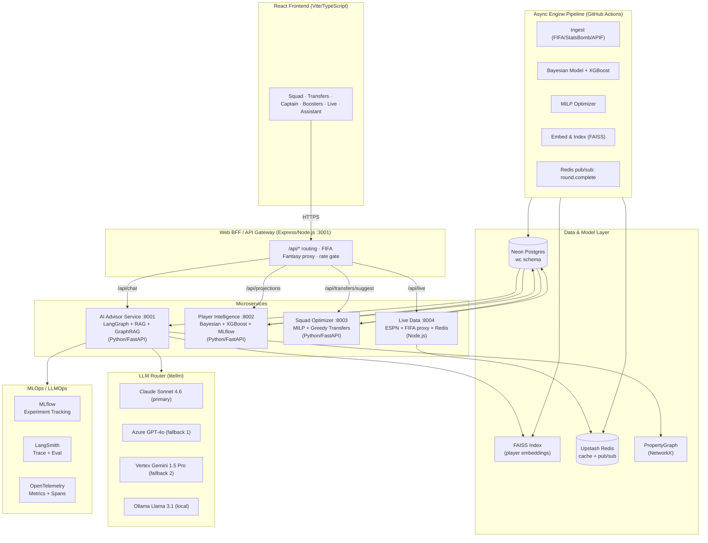

# wc-edge — FIFA WC 2026 Fantasy AI Companion

> **Live:** [wc-edge.onrender.com](https://wc-edge.onrender.com) · Tournament active since June 12, 2026

A production AI data science system for FIFA World Cup 2026 Fantasy. Squad builder, transfer advisor, captaincy ranker, live match tracker, and an agentic Edge AI advisor — all backed by Bayesian projection models, LangGraph multi-agent orchestration, RAG retrieval, and a full LLMOps stack.

---

## Tech Stack


---

## AI/ML Skills Coverage

| Skill Area | How It's Demonstrated |
|---|---|
| **Python, FastAPI, REST APIs** | All backend services: Python 3.12 + async FastAPI |
| **GPT-4, Claude, Gemini, Llama** | litellm Router: Claude primary → Azure GPT-4o → Vertex Gemini → Ollama Llama 3.1 |
| **RAG & Agentic AI** | LlamaIndex FAISS hybrid retrieval (BM25 + semantic), grounded AI advisor responses |
| **GraphRAG** | LlamaIndex PropertyGraphIndex: Player→Team→Fixture→Round→Stat, multi-hop traversal |
| **LangGraph, LlamaIndex, CrewAI** | LangGraph 6-node StateGraph orchestration + LlamaIndex indexing + CrewAI scaffold |
| **Prompt Engineering** | Versioned prompts (`system_v1/v2.md`), two-block cached architecture, few-shot examples |
| **Vector DBs: FAISS, Weaviate** | FAISS local dev with abstract `VectorStoreBackend` ABC; Weaviate prod drop-in |
| **Azure OpenAI, Vertex AI** | litellm fallback chain: Azure OpenAI GPT-4o → Vertex AI Gemini 1.5 Pro |
| **XGBoost + TimeSeriesSplit CV** | `train_xgb_model()` with temporal cross-validation; ensemble blend with Bayesian prior |
| **MLflow Model Registry** | Experiment tracking, CV RMSE governance gate, `Staging → Production` promotion |
| **Docker + Kubernetes** | `docker-compose.yml` (7 services), Helm charts for AKS/EKS/GKE with HPA + PDB |
| **LangSmith LLMOps** | Auto-traces all LangGraph runs; 4-dimension LLM-as-judge eval rubric |
| **OpenTelemetry** | Distributed tracing: agent node latency, LLM call duration, RAG retrieval time |
| **PyTorch / Transformers** | `sentence-transformers/all-MiniLM-L6-v2` for FAISS embeddings; LoRA/PEFT scaffold |
| **DSPy** | Few-shot optimizer with `xp_improvement_metric`; verifiable transfer quality signal |
| **Responsible AI** | Hallucination guard, citation grounding, prompt injection detection, bias audit doc |

---

## Architecture



---

## LangGraph Agent Pipeline

```
User Query
    │
    ▼
Router Agent          ← intent classification (transfer / captain / chip / general)
    │
    ├──────────────────┬──────────────────┐
    ▼                  ▼                  ▼
Transfer Advisor   Captaincy Advisor   Chip Strategist
    │                  │                  │
    └──────────────────┴──────────────────┘
                        │
                        ▼
                  Knowledge Agent    ← RAG + GraphRAG retrieval
                        │
                        ▼
                   Synthesizer       ← merge outputs, generate actions JSON
                        │
                        ▼
                   Guardrails        ← hallucination check, citation grounding
                        │
                        ▼
              SSE Stream → Frontend
```

---

## Repository Structure

```
wc-edge/
├── services/
│   ├── ai-advisor/           LangGraph + LlamaIndex RAG + GraphRAG + litellm
│   │   ├── agents/           6 LangGraph nodes
│   │   ├── rag/              FAISS indexer + hybrid retrieval + VectorStore ABC
│   │   ├── graphrag/         PropertyGraphIndex + multi-hop retriever
│   │   ├── models/           litellm router + guardrails + cost tracker
│   │   ├── finetuning/       DSPy optimizer + LoRA scaffold
│   │   ├── prompts/          Versioned system prompts + few-shot examples
│   │   └── crewai/           CrewAI alternative implementation
│   ├── player-intelligence/  Bayesian + XGBoost + MLflow
│   ├── squad-optimizer/      MILP + greedy transfer advisor (FastAPI)
│   └── live-data/            ESPN + FIFA proxy + Redis TTL cache
├── engine/                   ETL pipeline (FIFA Fantasy / StatsBomb / API-Football)
│   └── engine/
│       ├── wc_ingest.py      Data ingestion
│       ├── wc_model.py       Bayesian xG/xA + FDR + XGBoost ensemble
│       ├── wc_optimizer.py   HiGHS MILP squad optimizer
│       └── wc_run.py         Orchestrator
├── web/                      BFF (Express) + React frontend (Vite)
│   └── server/server.ts      13 routes + ai-advisor proxy + circuit breaker
├── k8s/helm/wc-edge/         Kubernetes Helm charts (HPA, PDB, Secrets)
├── docker-compose.yml        Local multi-service dev (7 containers)
├── docs/
│   ├── hld.md                High-level architecture
│   ├── lld.md                Service API contracts (OpenAPI)
│   ├── rag-design.md         RAG + GraphRAG design
│   ├── llmops.md             MLflow + LangSmith + OTel
│   ├── security.md           AI security + responsible AI
│   ├── adr/                  ADR 001–012
│   ├── ops.md                Tournament operations playbook
│   └── key-decisions.md      Core design decisions
└── CLAUDE.md                 AI coding assistant instructions
```

---

## Running Locally

```bash
# Frontend + BFF
cd web && npm run dev          # Express :3001 + Vite :5173

# Full microservices stack
docker compose up              # All services + Redis + MLflow at :5000

# Engine (Windows)
cd engine
$env:PYTHONUTF8=1
py -m engine.wc_run            # Bayesian model + optimizer

# Tests
cd web && npm test             # 129 vitest
cd engine && py -m pytest tests/ -v   # 49 pytest
cd services/ai-advisor && pytest tests/ -v   # async agent tests
```

**Required env vars:**
- `engine/.env`: `DATABASE_URL`, `API_FOOTBALL_KEY`
- `web/.env`: `DATABASE_URL`, `ANTHROPIC_API_KEY`
- `services/ai-advisor/.env`: `ANTHROPIC_API_KEY`, `AZURE_OPENAI_KEY`, `AZURE_OPENAI_ENDPOINT`, `LANGCHAIN_API_KEY`, `DATABASE_URL`, `REDIS_URL`

---

## WC 2026 Fantasy Rules

| Rule | Detail |
|---|---|
| Squad | 15 players: 2 GK / 5 DEF / 5 MID / 3 FWD |
| Budget | £100m group → £105m from R32 |
| Country limit | 3 (group) → 4 (R16) → 5 (QF) → 6 (SF) → 8 (Final) |
| Transfers | Group: 2 free/MD · R32: unlimited · R16/QF: 4 · SF: 5 · Final: 6 |
| Captain | 2× points; VC auto-activates if captain plays 0 min |

---

## Key Design Decisions

| Decision | See |
|---|---|
| Squad array ordering contract | [ADR 001](docs/adr/001-squad-array-ordering-contract.md) |
| `canAddPlayer()` as validation gate | [ADR 002](docs/adr/002-validation-gate-in-squad-validator.md) |
| xP breakdown storage (post-tournament) | [ADR 003](docs/adr/003-xp-breakdown-storage.md) |
| Game rules single source of truth | [ADR 004](docs/adr/004-game-rules-as-single-source.md) |
| In-memory rate limiter (accepted gap) | [ADR 005](docs/adr/005-in-memory-rate-limiter-accepted.md) |
| RAG with LlamaIndex + FAISS | [ADR 006](docs/adr/006-rag-llamaindex-faiss.md) |
| GraphRAG with PropertyGraphIndex | [ADR 007](docs/adr/007-graphrag-property-graph.md) |
| LangGraph multi-agent orchestration | [ADR 008](docs/adr/008-langgraph-multi-agent.md) |
| XGBoost + MLflow governance | [ADR 009](docs/adr/009-xgboost-mlflow-governance.md) |
| litellm multi-model router | [ADR 010](docs/adr/010-litellm-multi-model-router.md) |
| Prompt versioning + LangSmith | [ADR 011](docs/adr/011-prompt-versioning-langsmith.md) |
| Dynamic per-round FDR update | [ADR 012](docs/adr/012-dynamic-fdr-bayesian-update.md) |

---

*Built with Claude Code · Tournament ends ~July 19, 2026*
