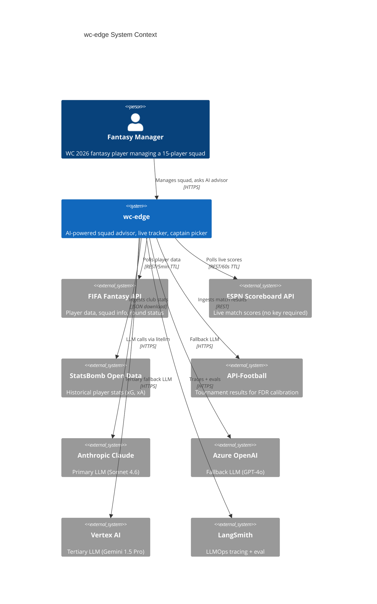
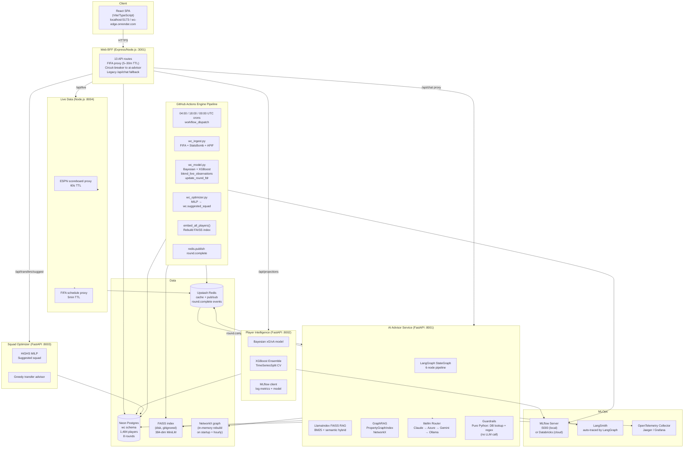

> **Context consolidated** — Architecture decisions from this file are referenced in [`.knowledge/sessions/000-existing-context.md`](../.knowledge/sessions/000-existing-context.md). This file remains the authoritative high-level design.

# High-Level Design — wc-edge Portfolio Architecture v2

**Status:** Proposed (Phase 0 — tournament live, microservices planned)  
**Date:** 2026-06-19

---

## Purpose

This document describes the target architecture for wc-edge after the portfolio enhancement phases. The existing production system (Express monolith on Render) continues to run unchanged during the tournament. All new capabilities are additive: new services, new endpoints, no changes to the production `/api/chat` path until the circuit-breaker BFF proxy is deployed.

---

## System Context



---

## Container Diagram



---

## Data Flow: AI Advisor Request

```
1. Browser POST /api/chat {messages, squadIds[], round}
2. BFF circuit-breaker: try ai-advisor :8001/chat (timeout 15s)
   └── fallback: legacy direct Claude call in server.ts
3. ai-advisor Router Agent: classify intent → 'transfer' | 'captain' | 'chip' | 'general'
4. Specialist agent (Transfer/Captaincy/Chip) runs: DB queries for xP/FDR
5. Knowledge Agent:
   a. RAG: LlamaIndex hybrid retrieval → top-5 player docs from FAISS
   b. GraphRAG: entity extraction → PropertyGraph traversal → fixture context
6. Synthesizer: merge agent_outputs + rag_context + graph_context → draft response
7. Guardrails (pure Python, no LLM): player name DB lookup + citation substring check + injection regex
8. SSE stream back: {status events} then {type:'done', content, actions, citations, token_usage}
9. BFF forwards SSE to browser
10. Frontend renders: status pill → response → citation footnotes → action buttons
```

---

## Async Engine Pipeline (GitHub Actions)

```
04:00 UTC cron (daily)
├── wc_ingest.py --source apif         fetch match results (32 req budget)
├── wc_ingest.py --source fifa          fetch updated player stats
├── wc_model.py run_model()             Bayesian xP + FDR
├── wc_model.py blend_live_observations() blend actual avgPoints into xP
├── wc_model.py update_round_fdr()     Bayesian FDR update from actuals
├── wc_model.py train_xgb_model()      XGBoost on completed rounds
├── wc_optimizer.py                     MILP → wc.suggested_squad
├── embed_all_players()                 rebuild FAISS index to /tmp/faiss_new
└── redis.publish "wc:events" "round.complete:{id}"
    └── ai-advisor subscribed:
        └── refresh_index(): atomic swap /tmp/faiss_new → INDEX_PATH

18:00 UTC cron
├── wc_model.py run_model() (skip apif)
├── blend_live_observations()
└── (no XGBoost if no new completed rounds)

00:00 UTC cron (post-match blend)
├── blend_live_observations()
└── update_round_fdr()
```

---

## Non-Functional Requirements

| Concern | Target | Mechanism |
|---|---|---|
| AI advisor latency (p95) | < 5s | SSE streaming + litellm 30s timeout |
| FAISS index refresh | < 60s rebuild | Background task + atomic swap |
| LLM cost per conversation | < $0.02 | Cached system prompt block (2048+ tokens) + top-k=3 RAG + Haiku router + deterministic guardrails |
| Production availability | Existing Render monolith unchanged during tournament | Circuit-breaker fallback to legacy handler |
| XGBoost governance | No regression on CV RMSE | MLflow `Staging → Production` gate |
| Hallucination rate | 0% invalid player names in actions | Guardrails DB lookup at response time |
| Secret management | No API keys in code or ConfigMaps | Kubernetes Secrets / Render env vars |

---

## Technology Choices Summary

| Layer | Choice | Rejected |
|---|---|---|
| Agent orchestration | LangGraph (Python) | CrewAI (less state control), AutoGen (MS-only) |
| RAG indexing | LlamaIndex + FAISS | Pinecone (paid), pure pgvector (no BM25) |
| Graph store | LlamaIndex PropertyGraphIndex + NetworkX | Neo4j (infra complexity), RDF (steep learning curve) |
| LLM routing | litellm Router | Custom proxy (reinventing the wheel) |
| ML experiment tracking | MLflow | W&B (paid at this scale), DVC (file-focused) |
| Embedding model | all-MiniLM-L6-v2 (CPU, 384-dim) | OpenAI embeddings (per-call cost) |
| Frontend | React + Vite + Zustand + React Query | Next.js (SSR complexity unnecessary) |
| Database | Neon Postgres (wc schema) | PlanetScale (MySQL, no pgvector) |

---

*See [lld.md](lld.md) for service API contracts · [rag-design.md](rag-design.md) for RAG/GraphRAG detail · [llmops.md](llmops.md) for MLflow/LangSmith setup*
